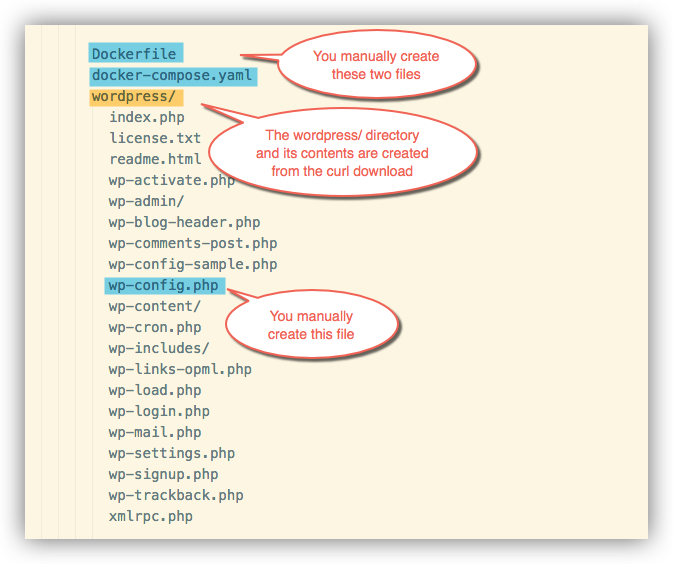
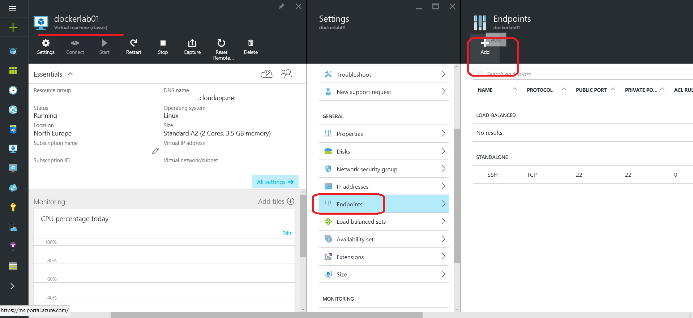
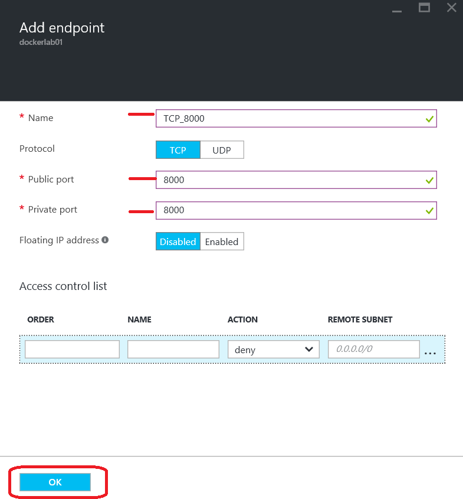
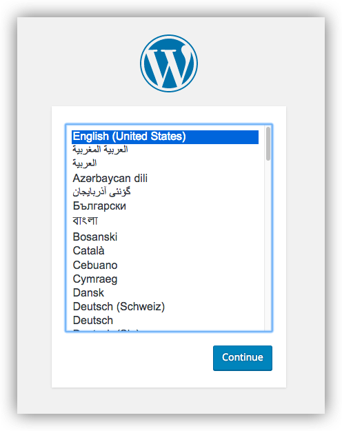

[Back to Menu](../README.md)

#Exercise 3 - Multi-container Applications with Docker Compose

**Compose** is a tool for defining and running multi-container Docker applications. With Compose, you use a Compose file to configure your application's services. Then, using a single command, you create and start all the services from your configuration. To learn more about all the features of Compose see [the list of features](https://docs.docker.com/compose/overview/#features).

Compose is great for development, testing, and staging environments, as well as CI workflows. You can learn more about each case in [Common Use Cases](https://docs.docker.com/compose/overview/#common-use-cases).

Using Compose is basically a three-step process.

1. Define your app's environment with a `Dockerfile` so it can be reproduced anywhere.

2. Define the services that make up your app in `docker-compose.yml` so they can be run together in an isolated environment.

3. Lastly, run `docker-compose build` and `docker-compose start`,and Compose will build, start and run your entire app.

## Learning by example: WordPress

You can use Docker Compose to easily run WordPress in an isolated environment built with Docker containers. This quick-start guide demonstrates how to use Compose to set up and run WordPress. 

###1. Create an empty project directory.

You can name the directory something easy for you to remember. This directory is the context for your application image. The directory should only contain resources to build that image.

This project directory will contain a `Dockerfile`, a `docker-compose.yaml` file, along with a downloaded wordpress directory and a custom `wp-config.php`, all of which you will create in the following steps.

```bash
$ cd ~
$ mkdir mywordpress
```

###2. Change directories into your project directory.
```bash
$ cd mywordpress/
```


###3. Create a `Dockerfile`

A `Dockerfile` is a file that defines the environment in which your application will run. See the previous exercise in this lab for details.

In this case, your `Dockerfile` should include these two lines:

```
FROM orchardup/php5
ADD . /code
```

This tells the Docker Engine daemon how to build an image defining a container that contains PHP and WordPress.


###4. Create a `docker-compose.yml` file 

The `docker-compose.yml` file is the imput for Composer, and will tell Composer to start your web service and a separate MySQL instance:

> Note: Do NOT use tabs to indent lines in YAML files. Use spaces instead. Tabs are not accepted and will produce errors when tools try to read tab-indented YAML files.

```
web:
  build: .
  command: php -S 0.0.0.0:8000 -t /code/wordpress/
  ports:
    - "8000:8000"
  links:
    - db
db:
  image: orchardup/mysql
  environment:
    MYSQL_DATABASE: wordpress
```


So what does the `docker-compose.yml` file above say about our application?

- It consists of two Docker images, `web` and `db`.
- `web` will be obtained by building from the current directory - using the `Dockerfile` we previously created.
- `web` will run built-in web server on port 8000, which will be accessible from outside the Docker environment
- `web` depends on the `db` image running
- `db` will be pulled from the Docker Hub and will have a custom `MYSQL_DATABASE` environment variable. 


###5. Download WordPress into the current directory

```bash
$ curl https://wordpress.org/latest.tar.gz | tar -xvzf -
```

This creates a directory called `wordpress` in your project directory.


###6. Create a `wp-config.php` file within the wordpress directory.

A supporting file is needed to get this working. At the top level of the `wordpress` directory, add a new file called `wp-config.php` as shown. This is the standard WordPress config file with a single change to point the database configuration at the `db` container:

```bash
<?php
define('DB_NAME', 'wordpress');
define('DB_USER', 'root');
define('DB_PASSWORD', '');
define('DB_HOST', "db:3306");
define('DB_CHARSET', 'utf8');
define('DB_COLLATE', '');

define('AUTH_KEY',         'put your unique phrase here');
define('SECURE_AUTH_KEY',  'put your unique phrase here');
define('LOGGED_IN_KEY',    'put your unique phrase here');
define('NONCE_KEY',        'put your unique phrase here');
define('AUTH_SALT',        'put your unique phrase here');
define('SECURE_AUTH_SALT', 'put your unique phrase here');
define('LOGGED_IN_SALT',   'put your unique phrase here');
define('NONCE_SALT',       'put your unique phrase here');

$table_prefix  = 'wp_';
define('WPLANG', '');
define('WP_DEBUG', false);

if ( !defined('ABSPATH') )
  define('ABSPATH', dirname(__FILE__) . '/');

require_once(ABSPATH . 'wp-settings.php');
?>
```

Note the `define('DB_HOST', "db:3306");` line. This uses the name of the image as defined in your Compose file, which is `db`. To understand how Docker creates and joins images to virtual networks, you should [read the networking documentation](https://docs.docker.com/engine/userguide/networking/dockernetworks/). For now, suffice to say that Docker joins each container under a specific name to the default network.

###7. Verify the contents and structure of your project directory




###8. Build the project

With those four new files in place, run `docker-compose build` from your project directory. This will pull and build the needed images.

```bash
$ docker-compose build
```

###9. Run the application

Once the project is built, you can run `docker-compose start` to start the web and database containers.

```bash
$ docker-compose start
```

###10. Open the TCP port in the Azure firewall

In order to be able to access your new web app, there is one more thing you need to do: tell Microsoft Azure to open up port 8000 on your VM.

To do that, find the VM in the Azure Portal, then click on `Settings` and then `Endpoints`.

 

Click `Add` to add a new endpoint. Make sure you enter 8000 for both the public and the private port, and leave `TCP` selected.



Click `OK` to add the new endpoint. Applying the changes can take up to 1-2 minutes.

###11. Test the application

At this point, WordPress should be running on port 8000 of your Docker Host, and you can complete the "famous five-minute installation" as a WordPress administrator.



###12. Stop the application

You can stop all the containers in your application by using `docker-compose stop`.

```bash
$ docker-compose stop
```

### References

This exercise borrows and adapts content from the following sources:

1. [The official Docker documentation](https://docs.docker.com/)
2. [The official Microsoft Azure documentation](https://azure.microsoft.com/en-us/documentation/)

[Back to Menu](../README.md)