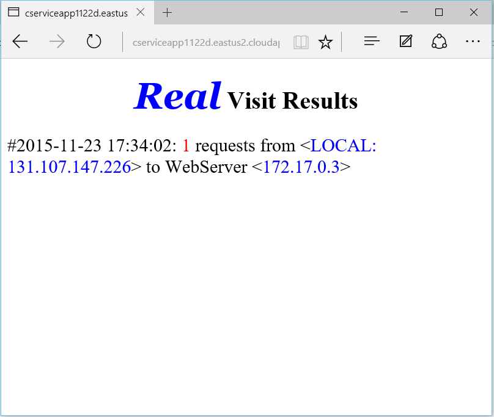

[Back to Menu](../README.md)

#Exercise 4 - Multi-host Cluster with Docker Swarm

> **WARNING**: During this exercise you will be creating a large number of Virtual Machines - at least six of them and possibly more. These machines can run out your Azure trial / Azure Pass credit very quickly if they are left running after you are done with the exercise. 

> We **strongly recommend** to delete the cluster when you're done, by following the **Cleanup** section at the end of this exercise.


**Docker Swarm** is native clustering for Docker. It turns a pool of Docker hosts into a single, virtual Docker host. Because Docker Swarm serves the standard Docker API, any tool that already communicates with a Docker daemon can use Swarm to transparently scale to multiple hosts. This includes the Docker Client as well as Docker Compose, both of which you have used in previous exercises.

Below you can see a schematic architecture of the Docker Swarm cluster we are going to set up in this exercise.


## Introducing Azure Templates

Normally, Swarm clusters can take a while to set up. The [official Docker documentation](https://docs.docker.com/swarm/) recommends using [Docker Machine](https://docs.docker.com/machine/) to set up a test cluster. 
However, with Microsoft Azure, there is a way to deploy a Swarm cluster in under five minutes, by using [Azure Resource Manager (ARM) Templates](https://azure.microsoft.com/en-us/documentation/templates/).

An **Azure Resource Manager Template** is an example of [Infrastructure as Code](https://en.wikipedia.org/wiki/Infrastructure_as_Code), and makes it possible for you to deploy and manage Azure resources together by using a [JSON description](https://github.com/Azure/azure-quickstart-templates/blob/master/docker-swarm-cluster/azuredeploy.json) of the resources and associated [deployment parameters](https://github.com/Azure/azure-quickstart-templates/blob/master/docker-swarm-cluster/azuredeploy.parameters.json). 

By using ARM templates you can provision any combination of Azure resources - Virtual Machines, websites, databases, storage, networking, load balancers and so on - as a single unit of deployment.

The templates are parametrizable, and deployment is fully integrated with the web-based [Azure Portal](https://portal.azure.com/), although deployment can be done by command-line tools as well.

Currently there is a [GitHub repository](https://github.com/Azure/azure-quickstart-templates) containing a large (and growing) set of templates covering a multitude of scenarios. There is also a web page available [to search for templates](https://azure.microsoft.com/en-us/documentation/templates/) in this repository.


In this exercise, we will be using one template from this repository to deploy a Docker Swarm cluster. 

## Step 1: Generate a public-private key pair

First we need to generate an asymmetric key pair to authenticate to our cluster. We are going to use [`ssh-keygen`](http://linux.die.net/man/1/ssh-keygen) for this task.

On the Linux VM you've been using for previous exercises in this lab, run the following commands:

```bash
$ cd ~/.ssh
$ ssh-keygen -t rsa

Enter file in which to save the key (/home/.../.ssh/id_rsa):
Enter passphrase (empty for no passphrase):
Enter same passphrase again:
Your identification has been saved in /home/.../.ssh/id_rsa.
Your public key has been saved in /home/.../.ssh/id_rsa.pub.
The key fingerprint is:
...
The key's randomart image is:
...
```

The tool will prompt you for filenames and passphrase. For this exercise, you can choose the default options.

Now open the `id_rsa.pub` file containing the public key and copy its entire contents to your computer / clipboard. You will need it during the next step.

## Step 2: Deploy a Swarm cluster

In your browser, navigate to the [Docker Swarm Cluster template](https://github.com/Azure/azure-quickstart-templates/tree/master/docker-swarm-cluster) page. 


Click the **Deploy to Azure** button. 

If you haven't logged into the Azure Portal, you will be prompted to do so. Afterwards, you will see a page like the one below, asking you to fill in the template parameters.


Make sure to enter the following values in the form:

1. SSHPUBLICKEY should be the entire contents of the `id_rsa.pub` file from Step 1.
2. NODECOUNT should be left at `3`.
3. Resource Group: select **New resource group name** and enter a name (for example `swarmcluster989`)
4. Make sure to **click and accept the legal terms** at the bottom of the form.

Now click the **Create** button to create the deployment. This should take 3-5 minutes to complete.

## Step 3: Connect to the cluster

First, find the Resource Group you just created. A **Resource Group** is a logical grouping of Azure resources that you manage as a unit.


Under **Last deployment** for the Resource Group, it should say **Succeeded**. Click that deployment.

> Note: while you are in the Resource Group screen, you can also check out all the resources which have been created. These include: [Virtual Machines](https://azure.microsoft.com/en-us/services/virtual-machines/), a [Virtual Network](https://azure.microsoft.com/en-us/services/virtual-network/), NICs, Firewall Rules, [Load Balancers](https://azure.microsoft.com/en-us/services/load-balancer/) and so on.

In the template deployment screen, you should see some attributes and output parameters for the deployment. 


What we are interested in are the first three parameters. Copy them to a text file for reference:

- `sshTunnelCmd` creates the SSH tunnel to connect to a Swarm manager.
- `dockerCmd` is the command to point the Docker Client at the swarm.
- `swarmNodesLoadBalancerAddress` is the load-balanced HTTP endpoint you use to access cluster-deployed apps.


The `sshTunnelCmd` command will help you create a SSH tunnel to Docker Swarm Manager from your machine (this command will keep running with no output). 

The command below is just an example - use the `sshTunnelCmd` you picked up from the deployment, and append an `&` at the end:

```bash
$ ssh -L 2375:swarm-master-0:2375 -N core@swarm-<<DNSNAME>>-manage.westus.cloudapp.azure.com -p 2200 &
```

> NOTE: Since `sshTunnelCmd` will keep running with no output, make sure you add the `&` character at the end of the command to return to the bash prompt.

> Alternatively, you can let the `sshTunnelCmd` session running and open a second SSH session from your PC to the VM.

After this you can use `dockerCmd` command that points to localhost, just as Swarm managers were running on your development machine:
```bash
$ docker -H tcp://localhost:2375 info
```
You should see an output listing all the nodes in the swarm.

## Step 4: Testing it out

Since the Docker CLI works seamlessly with a Swarm cluster just as it did with a single host, go ahead and try some of the commands you used in previous exercises.
Make sure you add `-H tcp://localhost:2375` to point Docker CLI to the cluster.

```bash
$ docker -H tcp://localhost:2375 ps

$ docker -H tcp://localhost:2375 pull docker/whalesay

$ docker -H tcp://localhost:2375 images

$ docker -H tcp://localhost:2375 run hello-world
``` 

> NOTE: depending on the various versions of the tools, you may get an error message *"client is newer than server"* when you try to access the cluster remotely. In that case, you can force the client to use an older version of the API: 

> `$ export DOCKER_API_VERSION=1.21`

> NOTE: you can point your docker client permanently at the Swarm cluster by typing

> `$ export DOCKER_HOST=:2375`

## Step 5: Scaling out an application

You can now scale out an application to the swarm cluster by running multiple instances of one (or more) images on the cluster, in a load balanced way.

First we will create our application. 

```bash
$ export DOCKER_HOST=:2375
$ docker ps

$ cd ~
$ mkdir swarmapp
$ cd swarmapp
$ touch docker-compose.yml
```

Open the file `docker-compose.yml` and add the following content:

```
web:
  image: "yeasy/simple-web"
  ports:
    - "80:80"
  restart: "always"
```

Build and run the application:

```bash
$ docker-compose up -d
```

After the application is running, run `docker ps` to check:

```bash
$ docker ps
CONTAINER ID        IMAGE               COMMAND                  CREATED             STATUS              PORTS                    NAMES
0648422f32c1        yeasy/simple-web    "/bin/sh -c 'python i"   14 seconds ago      Up 12 seconds       192.168.0.6:80->80/tcp   swarm-node-1/swarmapp_web_1
```

You can now scale the web application. For example, if you have 3 agents, you can type `docker-compose scale web=3` , and this will scale to the rest of your agents. Note that in this example you can only scale up to the number of agents that you have since each container requires port 80, so if you deployed a single agent, you won't be able to scale up. The Azure load balancer will automatically pick up the new containers.

```bash
$ docker-compose scale web=3
WARNING: The "web" service specifies a port on the host. If multiple containers for this service are created on a single host, the port will clash.
Creating and starting 2 ... done
Creating and starting 3 ... done
```

Now do `docker ps` again:

```bash
$ docker ps
CONTAINER ID        IMAGE               COMMAND                  CREATED             STATUS              PORTS                    NAMES
0bab09ff3d19        yeasy/simple-web    "/bin/sh -c 'python i"   7 seconds ago       Up 5 seconds        192.168.0.5:80->80/tcp   swarm-node-0/swarmapp_web_2
7c71dfe9a724        yeasy/simple-web    "/bin/sh -c 'python i"   7 seconds ago       Up 5 seconds        192.168.0.4:80->80/tcp   swarm-node-2/swarmapp_web_3
0648422f32c1        yeasy/simple-web    "/bin/sh -c 'python i"   8 minutes ago       Up 8 minutes        192.168.0.6:80->80/tcp   swarm-node-1/swarmapp_web_1
```

If you access the HTTP load-balanced endpoint contained in the output `swarmNodesLoadBalancerAddress`, you should see the web app running:



You can scale it back down to one node: 

```bash
$ docker-compose scale web=1
WARNING: The "web" service specifies a port on the host. If multiple containers for this service are created on a single host, the port will clash.
Stopping swarmapp_web_2 ... done
Stopping swarmapp_web_3 ... done
Removing swarmapp_web_2 ... done
Removing swarmapp_web_3 ... done
```

There you go - you have just scaled  a container application up and down, inside a Swarm cluster!

> NOTE: to point your Docker client back to the local Docker server, type

> `$ export DOCKER_HOST=`

## Cleanup

If you've created a Swarm cluster as described above, it's time to clean it up. The easiest way to do it is to delete the Resource Group, which will delete all the resources contained by it.


Enter the Resource Group name and hit **Delete**. 


All the resources related to the swarm will be deleted, including the Resource Group itself.

## Even better: Azure Container Service

Did you like the ability to stand up a full Swarm cluster in minutes by using a template? Then you'll be happy to know that Microsoft has a service coming out that will allow you to do just that, without the hassle of managing virtual machines.

[Azure Container Service](https://azure.microsoft.com/en-us/services/container-service/) (Preview) provides a way to simplify the creation, configuration, and management of a cluster of virtual machines that are preconfigured to run containerized applications. Using an optimized configuration of popular open-source scheduling and orchestration tools, ACS enables you to use your existing skills or draw upon a large and growing body of community expertise to deploy and manage container-based applications on Microsoft Azure. 

ACS will soon be available to deploy by using the Azure Portal. In the meantime, you can take a look at the [GitHub repo](https://github.com/Azure/azure-quickstart-templates/tree/master/101-acs-swarm) which will allow deploying of ACS via an ARM template, just as you did previously in this exercise.

### References

This exercise borrows and adapts content from the following sources:

1. [The official Microsoft Azure documentation](https://azure.microsoft.com/en-us/documentation/)
2. [Docker Swarm Cluster template](https://github.com/Azure/azure-quickstart-templates/tree/master/docker-swarm-cluster)
3. [Docker Swarm Container Service Walkthrough](https://github.com/Azure/azure-quickstart-templates/blob/master/101-acs-swarm/docs/SwarmPreviewWalkthrough.md)


[Back to Menu](../README.md)