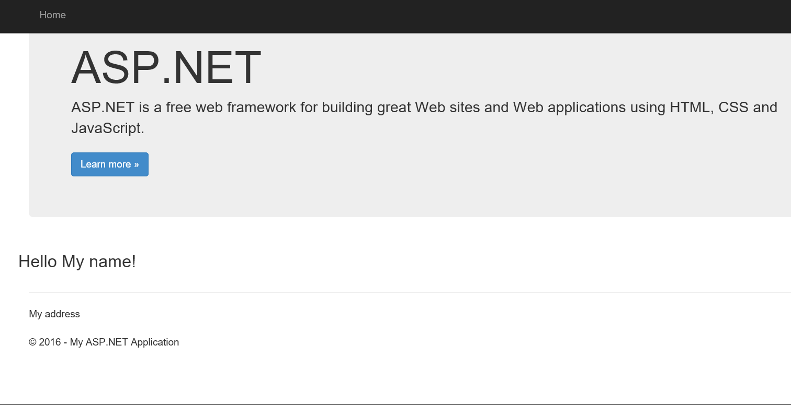

[Back to Menu](../README.md)

#Exercise 5 - Running ASP.NET 5 Web Applications under Linux with Docker

As a part Microsoft's ASP.NET 5 open source, cross-platform efforts, we are actively working on making applications written in ASP.NET 5 easy to deploy and ship on Linux and Mac OS X. A while ago, we have released the first official Docker image by Microsoft: [the ASP.NET Core Preview Docker Image](https://hub.docker.com/r/microsoft/aspnet/).

##Step 1: Create a container image for your app

In order to deliver your ASP.NET application to the cloud, you will need to create a container image containing your application.

Docker container images are layers on top of each other. This means your application is an addition on top of a "base image" - in this case the base image will be [`microsoft/aspnet`](http://registry.hub.docker.com/u/microsoft/aspnet/). The image layers are stored as diffs, therefore while deploying your application, your image will not contain the Linux distribution or the ASP.NET binaries; it will only contain your application, making it small in size and quickly deployable.

For the sake of this tutorial, we will use the [sample HelloMvc application](https://github.com/aspnet/Home/tree/master/samples/HelloMvc) from [`aspnet/Home`](https://github.com/aspnet/Home/) repository on GitHub. 

First, create a folder to build your project in.

```bash
$ cd ~
$ mkdir aspnet
$ cd aspnet
```

Then, clone this repository on your development machine and go to the `HelloWeb` directory using `git`:

```bash
$ git clone http://github.com/aspnet/Home.git aspnet-Home
$ cd aspnet-Home/samples/1.0.0-rc1-update1/HelloMvc
```

In this directory you will see a number of files, among them a `Dockerfile` and a `project.json` file:

```
Dockerfile
NuGet.Config
HelloWeb.xproj
project.json
wwwroot
  image.jpg
Controllers
  HomeController.cs
Models
  User.cs
Views
  Home
    Index.cshtml
  Shared
    _Layout.cshtml
```

Let's have a look at the `Dockerfile`:

```
FROM microsoft/aspnet:1.0.0-rc1-update1

COPY . /app/
WORKDIR /app
RUN ["dnu", "restore"]

EXPOSE 5004
ENTRYPOINT ["dnx", "-p", "project.json", "web"]
```

Let's go through this `Dockerfile` line by line. The first `FROM` line tells Docker that we will use [the official ASP.NET image on Docker Hub](http://registry.hub.docker.com/u/microsoft/aspnet/) as our base image. We also specify an image version to use.

The `COPY` line tells Docker that we will copy contents of this folder (.) to the /app directory of the container and the `WORKDIR` instruction will move to the /app directory.

The `RUN` instruction tells Docker to run the `dnu restore` command to install the dependencies of the application. We do this before running out application for the first time.

The `EXPOSE` instruction will inform Docker that this image has a service which will be listening at port `5004` (see `project.json` of the sample file for details). 

Lastly, the `ENTRYPOINT` instruction is the command executed to start the container and keep it up and running. In this case it is the `dnx -p project.json` command, starting the [Kestrel development server](https://github.com/aspnet/KestrelHttpServer) for ASP.NET 5. Once executed, this process will start listening to HTTP connections coming from port 5004. For more details as to how this is all wired up, have a look at the `project.json` file.

##Step 2: Build the container image

Now we will actually build the Docker image. It is very simple - just run the following Docker command in this directory:

```bash
$ docker build -t myapp .
```

This will build an image using the `Dockerfile` we just created and call it `myapp`. Every time you change your application, a new image can be built using this command. After this command finishes, we should be able to see our application in the list of Docker images on our Linux VM by running the following command on our development machine:

```bash
$ docker images
REPOSITORY          TAG                 IMAGE ID            CREATED             VIRTUAL SIZE
myapp               latest              ccb7994d2bc1        39 seconds ago      499.8 MB
microsoft/aspnet    latest              16b1838c0b34        12 days ago         473.4 MB
```

As you can see, your app and the ASP.NET image are listed as images that exist on your machine.

Now we are ready to deploy our application to the cloud.

##Step 3: Run the container

Run the following Docker command on your development machine:

```bash
$ docker run -t -d -p 80:5004 myapp
```

- The `-t` switch attaches a pseudo-tty to the container (this switch will not be necessary in future versions of ASP.NET 5).
- The `-d` switch runs the container in the background, otherwise the web server's standard input/output streams would be attached to our development machine's shell.
- The `-p` switch maps port 80 of the VM to port 5004 of the container. In this case, connections coming to port 80 of the VM will be forwarded to our container listening on port 5004.
- Lastly, `myapp` is the Docker image name we are using to start the container. We built this image in the previous step.

Once the container is started, the following command can be used to show containers running on your machine:

```bash
$ docker ps
CONTAINER ID        IMAGE               COMMAND                CREATED              STATUS              PORTS                  NAMES
f70bd9ffbc36        myapp:latest        "/bin/sh -c 'dnx .     About a minute ago   Up About a minute   0.0.0.0:80->5004/tcp   mad_goodall
```

Our container has started! However, we are not quite done yet. We need to complete the endpoint port mapping for Azure VM. You need to go to the Azure Management Portal to map public TCP port 80 to internal port 80 on your Linux VM (see [relevant tutorial here](http://azure.microsoft.com/en-us/documentation/articles/virtual-machines-set-up-endpoints/)).

Now let's head to the browser to see if it is working. Open http://your-cloud-service-name.cloudapp.net:80/ in your web browser:



Voila, you have an ASP.NET 5 application running on Linux inside a Docker container!

##Conclusion

Microsoft will continue to invest in running ASP.NET 5 applications on Linux and Docker and we are happy to bring you the Microsoft's first official Docker image: ASP.NET 5 Preview Image.

### References

This exercise borrows and adapts content from the following sources:

1. [Running ASP.NET 5 applications in Linux Containers with Docker](https://blogs.msdn.microsoft.com/webdev/2015/01/14/running-asp-net-5-applications-in-linux-containers-with-docker/)

[Back to Menu](../README.md)