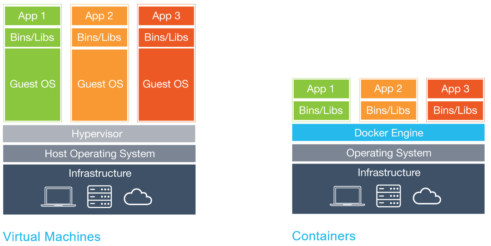
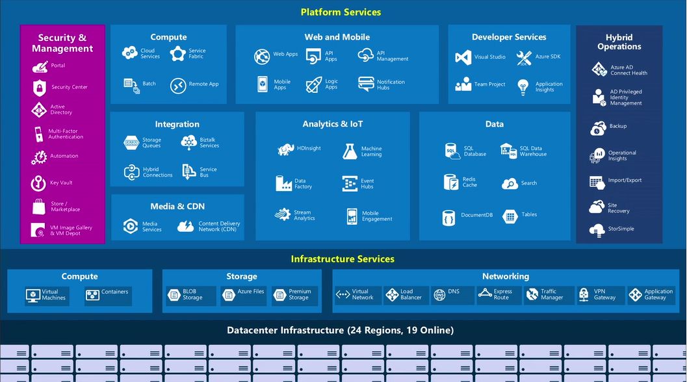

# Docker Hands-on Lab

This is a hands-on lab for getting started with [Docker](https://www.docker.com/) using [Microsoft Azure](https://azure.microsoft.com/).

## Lab Setup

Before you can perform any exercises in this lab, please follow the [Setup](Setup/README.md) section which will help you provision the required Azure resources.
The [Setup](Setup/README.md) section also lists requirements for this lab.

## Exercises in this lab

[Setup - Create a Free Azure Subscription and set up Ubuntu Docker Host](Setup/README.md)

[Exercise 1 - Docker Commands](Exercise01/README.md)

[Exercise 2 - Docker Images](Exercise02/README.md)

[Exercise 3 - Multi-container Applications with Docker Compose](Exercise03/README.md)

[Exercise 4 - Multi-host Cluster with Docker Swarm](Exercise04/README.md)

[Exercise 5 - Running ASP.NET 5 Web Applications under Linux with Docker](Exercise05/README.md)

## What is Docker?

[Docker](https://www.docker.com/) allows you to package an application with all of its dependencies into a standardized unit for software development.

Docker containers wrap up a piece of software in a complete filesystem that contains everything it needs to run: code, runtime, system tools, system libraries - anything you can install on a server. This guarantees that it will always run the same, regardless of the environment it is running in. 

Docker containers are **lightweight**. Containers running on a single machine all share the same operating system kernel so they start instantly and make more efficient use of RAM. Images are constructed from layered filesystems so they can share common files, making disk usage and image downloads much more efficient.

Each **virtual machine** includes the application, the necessary binaries and libraries and an entire guest operating system - all of which may be tens of GBs in size.

By contrast, **Containers** include the application and all of its dependencies, but share the kernel with other containers. They run as an isolated process in userspace on the host operating system. They're also not tied to any specific infrastructure - Docker containers run on any computer, on any infrastructure and in any cloud. 

## Why use Docker to build applications?

There are several good reasons to consider Docker:

- **Consistent Environments**. By packaging up the application with its configs and dependencies together and shipping as a container, the application will always work as designed locally, on another machine, in test or production. No more worries about having to install the same configs into a different environment.
- **Small Footprint**. As explained above, sharing a kernel and filesystem layering makes for very small containers.
- **Continuous Delivery**. Your Continous Integration and Continous Delivery solution - for instance [Visual Studio Team System](https://www.visualstudio.com/), [Team Foundation Server](https://www.visualstudio.com/en-us/products/tfs-overview-vs.aspx) or [Jenkins](http://jenkins-ci.org/) - can be easily configured to use Docker containers to automatically build, deploy and test apps. So you can get a fully automated dev / test / production pipeline.
- **Work together**. With [Docker Hub](https://hub.docker.com/) you can create and share your Docker images with other developers. Or you can stand up your private hub for your company to use.

## What is Microsoft Azure?

[Microsoft Azure](https://azure.microsoft.com/) is a growing collection of [integrated cloud services](https://azure.microsoft.com/en-us/services/) - analytics, computing, database, mobile, networking, storage, and web.

Azure supports the broadest selection of operating systems, programming languages, frameworks, tools, databases and devices. Run Linux containers with Docker integration; build apps with JavaScript, Python, .NET, PHP, Java and Node.js; build back-ends for iOS, Android and Windows devices. Azure cloud service supports the same technologies millions of developers and IT professionals already rely on and trust.

## How can Azure make your Docker experience better?

Microsoft Azure is a great platform for running Docker workloads. Why?

1. It allows you to easily deploy and configure Docker on any Linux Virtual Machine deployed in Azure, by means of the [Docker VM Extension](https://github.com/Azure/azure-docker-extension/blob/master/README.md). 
2. It allows easy deployment and configuration of multi-host Docker clusters - or [Swarms](https://docs.docker.com/swarm/) - by using JSON-based deployment templates. You can stand up 100-node clusters in minutes by using [Azure Resource Manager templates](https://azure.microsoft.com/en-us/documentation/templates/). [Exercise 4 - Multi-host Cluster with Docker Swarm](Exercise04/README.md) contains an example of this.
3. It offers a fully-managed clustering service called [Azure Container Service](https://azure.microsoft.com/en-us/services/container-service/) which can manage Docker clusters - as well as [Apache Mesos](https://mesos.apache.org/) clusters - without you having to manage Virtual Machines. An example of using ACS with Docker is [here](https://github.com/Azure/azure-quickstart-templates/tree/master/101-acs-swarm).
4. It allows you to [run Docker on Windows](https://azure.microsoft.com/en-us/blog/docker-client-for-windows-is-now-available/). 
5. It allows you to run [ASP.NET websites on Linux with Docker](https://blogs.msdn.microsoft.com/webdev/2015/01/14/running-asp-net-5-applications-in-linux-containers-with-docker/) by using Microsoft-supported, open source frameworks like [ASP.NET MVC 5](http://www.asp.net/mvc/mvc5) and [.NET Core](https://github.com/dotnet/core).

**Want to try it out for yourself?** Then go ahead and [set up your environment](Setup/README.md) and try the exercises in this lab!

### References

This hands-on lab borrows and adapts content from the following sources:

1. [The official Docker documentation](https://docs.docker.com/)
2. [The official Microsoft Azure documentation](https://azure.microsoft.com/en-us/documentation/)
3. [Running ASP.NET 5 applications in Linux Containers with Docker](https://blogs.msdn.microsoft.com/webdev/2015/01/14/running-asp-net-5-applications-in-linux-containers-with-docker/)
4. [Docker Swarm Cluster template](https://github.com/Azure/azure-quickstart-templates/tree/master/docker-swarm-cluster)
5. [Docker Swarm Container Service Walkthrough](https://github.com/Azure/azure-quickstart-templates/blob/master/101-acs-swarm/docs/SwarmPreviewWalkthrough.md)
